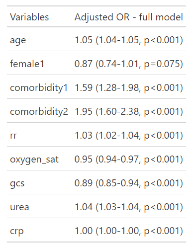
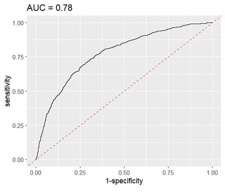
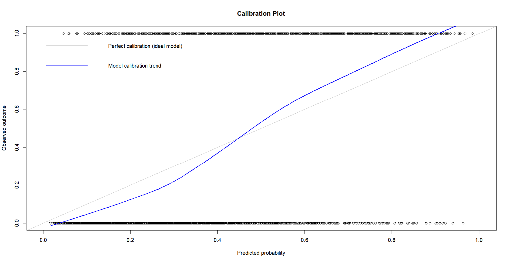
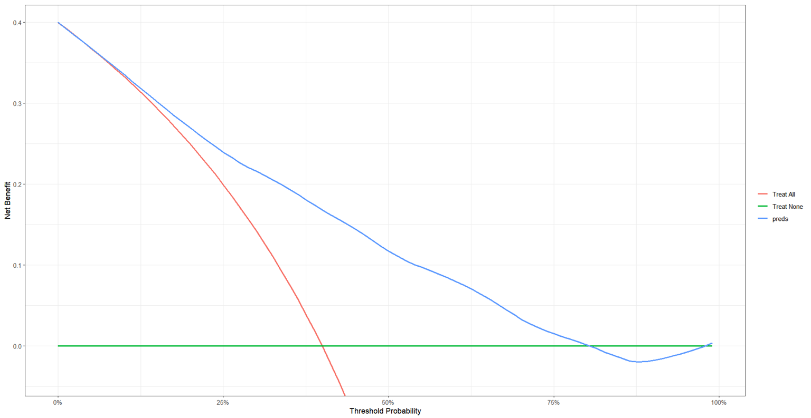

```{r setup, warning=FALSE, message=FALSE, echo=FALSE}
#theme_set(theme_bw(base_size=18))
#theme_update(plot.title = element_text(hjust = 0.5))
#set.seed(865765)
```

```{css,echo=FALSE}
.styled-output .cell-output {
  background-color: lightblue;
  border-radius: 4px;
}
```

# 1. Data preparation

## Load data and split into development and validation sets

``` {.zsh filename="R"}
# Load required package for data handling and analysis
library(tidyverse)

# Import the COVID-19 dataset
data<- read.csv("covidpredict-1.csv")

# Convert categorical variables to factors
# so they are treated correctly in the logistic regression model(for sex is not necessary)
data$comorbidity <- factor(data$comorbidity)
data$female <- factor(data$female)

 
# Split the dataset into development cohort for model training
dev<- subset(data, set == "dev")

# Split the dataset into validation cohort for model evaluation
val<-subset(data, set == "val")
```

::: panel-tabset
## covidpredict-1.csv

<!-- </details> -->

```{r}
#| code-fold: true
#| label: tb1
#| tbl-cap: "First rows of the estimation dataset"

dat <- readr::read_csv(file.path('.','covidpredict-1.csv'),
                       show_col_types = FALSE)


knitr::kable(head(dat,n=21),booktabs=TRUE) |> 
  kableExtra::kable_styling("striped",full_width = F)
```

## dev.csv

<!-- </details> -->

```{r}
#| code-fold: true
#| label: tb2
#| tbl-cap: "First rows of the estimation dataset"

dat <- readr::read_csv(file.path('.','dev.csv'),
                       show_col_types = FALSE)


knitr::kable(head(dat,n=21),booktabs=TRUE) |> 
  kableExtra::kable_styling("striped",full_width = F)
```

## val.csv

<!-- </details> -->

```{r}
#| code-fold: true
#| label: tb3
#| tbl-cap: "First rows of the estimation dataset"

dat <- readr::read_csv(file.path('.','val.csv'),
                       show_col_types = FALSE)


knitr::kable(head(dat,n=21),booktabs=TRUE) |> 
  kableExtra::kable_styling("striped",full_width = F)
```
:::

## Model development

The logistic regresson equation:

log(p/(1-p))=β0+β1rr+β2oxygen_sat+β3urea+β4crp+β5gcs+β6age+β7female+β8comorbidity

``` {.zsh filename="R"}
# Fit a multivariable logistic regression model to predict
# in-hospital mortality using the development dataset
# Continuous predictors are assumed to have linear effects
model <- glm(mortality ~ rr + oxygen_sat + urea + crp +
               gcs+ age + female+
               comorbidity  ,
             data = dev,
             family = "binomial"
)
```

Results of the multivariable logistic regression model, including coefficient estimates and p-values for each predictor.

``` {.zsh filename="R"}
# Display model coefficients, standard errors,
# and statistical significance (p-values)
summary(model)

Call:
glm(formula = mortality ~ rr + oxygen_sat + urea + crp + gcs + 
    age + female + comorbidity, family = "binomial", data = dev)

Coefficients:
               Estimate Std. Error z value Pr(>|z|)    
(Intercept)   0.1609377  0.7886319   0.204   0.8383    
rr            0.0288028  0.0046577   6.184 6.25e-10 ***
oxygen_sat   -0.0493779  0.0072999  -6.764 1.34e-11 ***
urea          0.0355580  0.0040465   8.787  < 2e-16 ***
crp           0.0026643  0.0004177   6.378 1.80e-10 ***
gcs          -0.1131151  0.0254752  -4.440 8.99e-06 ***
age           0.0464053  0.0027230  17.042  < 2e-16 ***
female1      -0.1407743  0.0791202  -1.779   0.0752 .  
comorbidity1  0.4628602  0.1119387   4.135 3.55e-05 ***
comorbidity2  0.6676253  0.1007861   6.624 3.49e-11 ***
---
Signif. codes:  0 ‘***’ 0.001 ‘**’ 0.01 ‘*’ 0.05 ‘.’ 0.1 ‘ ’ 1

(Dispersion parameter for binomial family taken to be 1)

    Null deviance: 4723.5  on 3545  degrees of freedom
Residual deviance: 3904.8  on 3536  degrees of freedom
AIC: 3924.8

Number of Fisher Scoring iterations: 4
```

## OR and 95% CI

``` {.zsh filename="R"}
# Load packages for regression table formatting
library(gt)
library(finalfit)

# Define the dependent (outcome) variable and
# independent (predictor) variables for the model
dependent <- "mortality"
independent <- c("age", "female", "comorbidity", "rr",
                 "oxygen_sat", "gcs", "urea", "crp")


# Generate a formatted summary table of the multivariable
# logistic regression model, including adjusted odds ratios
# and corresponding confidence intervals
glmmulti_full <- dev |>
  glmmulti(dependent, independent) |>
  fit2df(
    explanatory_name = "Variables",
    estimate_name = "Adjusted OR - full model",
  )

# Display the regression results as a formatted table
glmmulti_full |>
  gt()
```



Comorbidities had three levels (0, 1, and 2), with 0 as the reference category. The odds ratio for comorbidity1, indicates higher odds of mortality in patients with one comobidity compared to patients with no comorbidities, and the odds ratio for comorbidity2, indicates even higher odds of mortality in patients with 2 comobidities compared to those with no comorbidities. Increasing age (OR = 1.05 per year), higher respiratory rate (OR = 1.03), elevated urea level (OR = 1.04), and the presence of comorbidities (OR = 1.59 and OR = 1.95) were all significantly associated with increased odds of mortality (all p \< 0.001). In contrast, higher oxygen saturation (OR = 0.95) and better neurological status as measured by the Glasgow Coma Scale (OR = 0.89) were associated with lower mortality risk (p \< 0.001). Sex was not statistically significant (p = 0.075). In overall, comorbidity burden and physiological derangement showed the strongest associations with mortality.

# 2. Model validation

Predict the probability of in-hospital mortality in the validation data set using the developed logistic regression model.

``` {.zsh filename="R"}
# Use the developed logistic regression model to predict
# probability of in-hospital mortality in the validation dataset

preds <- predict(model,
                 newdata = val,
                 type = "response"
)
```

``` {.zsh filename="R"}
# Classify patients based on a probability threshold (0.5):
# patients with predicted probability < 0.5 are classified as survival (0),
# and ≥ 0.5 as mortality (1)
preds_outcome <- ifelse(preds < 0.5, 0, 1)
```

``` {.zsh filename="R"}
# Create a matrix comparing observed vs predicted outcomes
tab <- table(val$mortality, preds_outcome,
             dnn = c("observed", "predicted"))

# Display matrix
tab
          predicted
            0     1
observed 0 1131  212
         1  419  474
```

``` {.zsh filename="R"}
# Calculate overall classification accuracy
# proportion of correctly classified patients
accuracy <- sum(diag(tab)) / sum(tab)
accuracy

0.7177996
```

The model achieved an accuracy of 0.72, indicating that approximately 72% of patients in the validation data set were correctly classified with respect to in-hospital mortality.

## sensitivity

Sensitivity refers to the model's ability to correctly identify individuals who experienced the event (death).

sensitivity = (True Positives)/(True Positives+False Negatives)

``` {.zsh filename="R"}
# Sensitivity (True Positive Rate):
# ability of the model to correctly identify patients who died

sensitivity <- tab[2, 2] / (tab[2, 2] + tab[2, 1])
sensitivity

0.5307951
```

The sensitivity of 0.53 indicates that the model correctly identifies approximately 53% of patients who died in hospital (true positives), suggesting moderate ability to detect high-risk patients.

At the chosen threshold, sensitivity was modest, indicating that a substantial proportion of patients who died were not identified.

## specificity

specificity refers to model's ability to correctly identify those who did not experienced the event (alive).

specificity = (True Negatives)/(True Negatives+False Positives)

``` {.zsh filename="R"}
# Specificity (True Negative Rate):
# ability of the model to correctly identify survivors

specificity <- tab[1, 1] / (tab[1, 1] + tab[1, 2])
specificity

0.8421445
```

The specificity of 0.84 indicates that the model correctly identifies approximately 84% of patients who survived (true negatives), showing a good ability to rule out mortality in low-risk patients.

## AUC and ROC curve

The ROC curve (Receiver Operating Characteristic curve) is a graphical tool used to evaluate the discriminative performance of a prediction model. It plots the true positive rate (sensitivity) against the function of the false positive rate (1 − specificity) across a range of possible decision thresholds. Each point on the curve represents a different cut-off value for classifying patients as high or low risk. A model with perfect discrimination would reach the upper-left corner of the plot (100% sensitivity and 100% specificity). Therefore, the closer the ROC curve is to this corner, the better the model's ability to distinguish between patients who experience the event and those who do not.

The 45-degree diagonal line (AUC = 0.5) represents random guessing. If the curve is on or below this line, the model is not useful.

In the plot, the closer the ROC curve is to the upper left-hand corner, the better the model, and the closer the AUC is to 1, the better the model.

``` {.zsh filename="R"}
# Load package for ROC analysis
library(pROC)

# Construct ROC curve using predicted probabilities
res <- roc(mortality ~ preds,
           data = val)

# Compute Area Under the Curve (AUC)
auc(res)

# Extract AUC value
res$auc

# plot ROC curve with AUC in title

ggroc(res, legacy.axes = TRUE) +
  geom_abline(intercept = 0, slope = 1, linetype = "dashed", color = "red") +
  labs(title = paste0("AUC = ", round(res$auc, 2)))

# Interpretation:
# The closer the ROC curve is to the top-left corner,
# the better the model discrimination ability.
# AUC closer to 1 indicates better performance..
```



The ROC curve demonstrated acceptable discrimination with an AUC of 0.78. The curve lies above the 45-degree reference line, indicating performance better than chance; however, it does not closely approach the upper-left corner, suggesting that the model has only moderate ability to achieve both high sensitivity and high specificity simultaneously.

## PPV (Positive Predictive Value)

PPV=(True Positive)/(False Positive+True Positive)

the probability that a patient actually experienced in-hospital mortality when the model predicts a positive outcome (high risk), expressed as a percentage.

``` {.zsh filename="R"}
# Positive Predictive Value (PPV):
# probability that predicted positives are truly positive

PPV <- tab[2,2] / (tab[2,2] + tab[1,2])
PPV

0.6909621
```

The PPV of 0.69 indicates that 69% of patients classified as high-risk by the model died in hospital. This suggests a moderate probability that a positive prediction corresponds to the outcome; however, predictive values are influenced by outcome prevalence and should be interpreted in the context of the study population and chosen decision threshold.

## NPV (Negative Predictive Value)

NPV=(True Negative)/(False Negative+True Negative)

the probability that a patient did not experience in-hospital mortality when the model predicts a negative outcome (low risk), expressed as a percentage.

``` {.zsh filename="R"}
# Negative Predictive Value (NPV):
# probability that predicted negatives are truly negative

NPV <- tab[1,1] / (tab[1,1] + tab[2,1])
NPV

0.7296774
```

The NPV of 0.73 indicates that 73% of patients classified as low-risk by the model survived in hospital. This suggests a moderate ability to correctly identify patients who are unlikely to experience in-hospital mortality.

## Calibration plot

A calibration plot assesses how well predicted probabilities agree with observed outcomes by comparing predicted risk (x-axis) with actual event rates (y-axis). The 45-degree diagonal line represents perfect calibration, where predicted risk equals observed risk.

``` {.zsh filename="R"}
# Add predicted probabilities to validation dataset
# This is required for calibration assessment
val$preds <- preds

# Define a custom calibration plot function
# This function compares predicted probabilities vs observed outcomes
# and visualises model calibration
val.prob.ci.2 <- function(p, y,
                          xlab = "Predicted probability",
                          ylab = "Observed outcome") {
  
# Scatter plot of predicted probabilities vs observed outcomes
  plot(p, y,
       xlim = c(0, 1),
       ylim = c(0, 1),
       xlab = xlab,
       ylab = ylab,
       main = "Calibration Plot")
  
# Add reference line representing perfect calibration
# (ideal model where predicted = observed)
  abline(0, 1, col = "gray", lwd = 1)
  
# Add smoothed calibration curve using LOESS
# to assess systematic over- or underestimation
  lines(lowess(p, y), col = "blue", lwd = 2)
  
# Add legend for interpretation
  legend("topleft",
         legend = c("Perfect calibration (ideal model)",
                    "Model calibration trend"),
         col = c("gray", "blue"),
         lwd = c(1, 2),
         bty = "n")
}

# Run calibration plot function on validation data
val.prob.ci.2(p = val$preds, y = val$mortality)
```



The calibration plot shows that the model **overestimates risk at lower predicted probabilities (below 0.45)** and **underestimates risk at higher probabilities (above 0.45)**.

# decision curve

A decision curve (decision curve analysis plot) is a graph that shows how much net clinical benefit a prediction model provides compared to the strategies of treating all patients or treating none across different threshold probabilities.

**NB= (True Positive/N)-(False Positive/N)\*(Threshold Probability/(1-Threshold Probability))**

-   **NB (Net Benefit):** the overall clinical usefulness of the model.

-   **True Positives:** patients correctly identified as high risk (correct ICU admissions).

-   **False Positives:** patients incorrectly identified as high risk (unnecessary ICU admissions).

-   **N (Total number of patients):** sample size in the data set .

-   **Threshold probability:** the risk cutoff at which a clinician decides to treat or not treat (e.g., ICU vs general ward)

``` {.zsh filename="R"}
# Load package for decision curve analysis
library(dcurves)

# Perform decision curve analysis to evaluate clinical utility
# across a range of threshold probabilities
dca(mortality ~ preds,
    data = val,
    time = 1.5,
    thresholds = seq(0, 1, 0.01),
    label = list(pr_failure18 = "Prediction Model")
) %>%
  plot(smooth = TRUE)
```



Between 0--10% threshold probability, the model performs similarly to the "treat all" strategy, showing no clear additional clinical benefit. Between about 10 %--40%, the model achieves the highest net benefit and clearly outperforms both "treat all" and "treat none," making it most useful for ICU decision-making. After 40%, its benefit declines, and beyond about 81% the net benefit of the model becomes negative, meaning the model performs worse than treating no patients and should not be used in that range.

# value_of_information

Value of information quantifies the expected loss in net benefit due to uncertainty in model performance, and indicates whether additional data collection (e.g., further validation) is worthwhile.

External validation is essential when applying a risk prediction model in a new setting, but limited sample sizes introduce uncertainty about its true performance. This uncertainty can reduce the net benefit, as it becomes unclear whether using the model is better than alternative strategies. The expected value of perfect information (EVPI) quantifies the potential loss in net benefit due to this uncertainty and can be calculated once external validation data are available. Therefore, while model adoption should be guided by its expected net benefit, value-of-information methods can help determine whether additional validation studies are needed.

``` {.zsh filename="R"}
library(MASS)
#Step 1:add the predicted probabilities to validation data
val$preds <- preds

# Number of observations in validation dataset
n <- nrow(val)

# Threshold probability for clinical decision-making
z <- 0.1

#Step 2:The bootstrap Monte Carlo simulation
# Number of bootstrap iterations for Monte Carlo simulation
N <- 10000

# Initialize vectors to store results
NBmodel <- NBall <- NBmax <-rep(0, N)

# Monte Carlo bootstrap simulation to estimate uncertainty
for(i in 1:N){
# Resample validation dataset with replacement
  bsdata <- val[sample(1:n, n, replace = TRUE),]
# Net benefit of treating all patients  
  NBall[i] <- mean(bsdata$mortality - (1 - bsdata$mortality)*z/(1-z))
# Net benefit of prediction model-based decision 
  NBmodel[i] <- mean((bsdata$preds > z) * 
                       (bsdata$mortality - (1 - bsdata$mortality)*z/(1-z)))
}
#Step 3:EVPI calculation
# Calculate Expected Value of Perfect Information (EVPI)
# Difference between perfect decision-making and current model uncertainty
EVPI <- mean(pmax(0, NBmodel, NBall)) - 
  max(0, mean(NBmodel), mean(NBall))

EVPI


2.673425e-06
```

The estimated EVPI is extremely small, indicating that the expected loss in net benefit due to uncertainty is negligible. This suggests that additional validation using similar data would not provide meaningful additional information or improve decision-making. However, as this analysis is based on temporal rather than true external validation, some uncertainty regarding transportability to other settings may still

# Model generalizability

## *Imagine it is December 2021. Can the model be used to support decision-making in Dutch hospitals? What do you recommend with respect to the need for furtherexternal validation?*

The model showed reasonably good performance in the temporal validation dataset, but it should not be used directly in Dutch hospitals in December 2021 without further validation.

The model was developed using data from UK patients during the first wave of COVID-19 in early 2020. By the end of 2021, the situation had changed a lot. Many people had been vaccinated, new COVID-19 variants had appeared, and treatments for COVID-19 had improved. Because of these changes, the risk of dying in hospital was probably different from the risk seen in the original data set.

There may also be differences between hospitals in the UK and the Netherlands, such as ICU admission policies, prevalence of severe COVID-19 cases, treatment strategies, and methods used to diagnose and detect the disease. Differences in patient characteristics and healthcare organization can also affect how well the model works in a new population. These factors may change both the overall mortality risk and the relationship between predictors and outcomes.

For these reasons, the model should first be tested using Dutch patient data from 2021 before being used in clinical practice. This external validation should check whether the model can still correctly identify high-risk patients.
